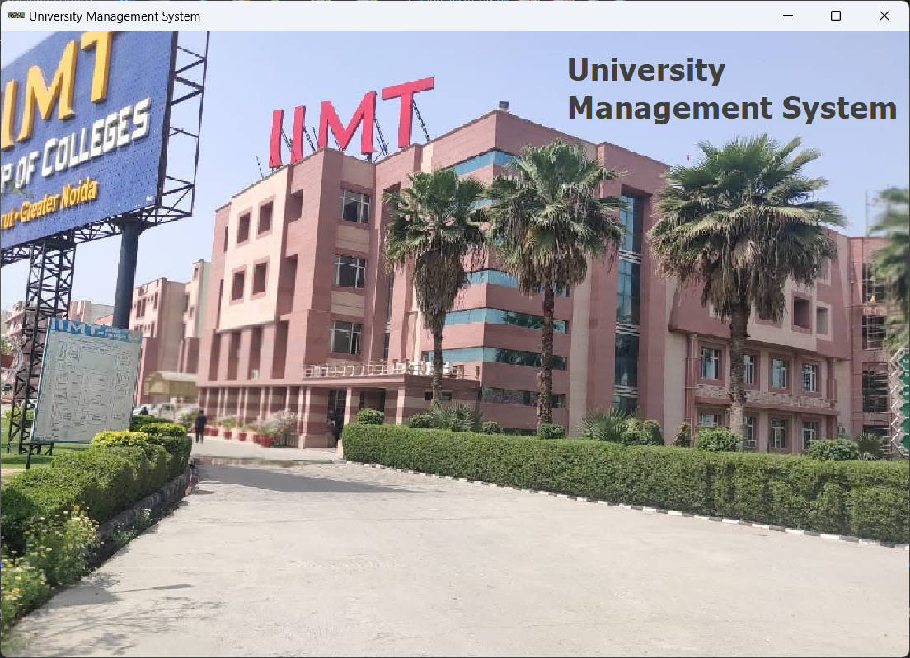
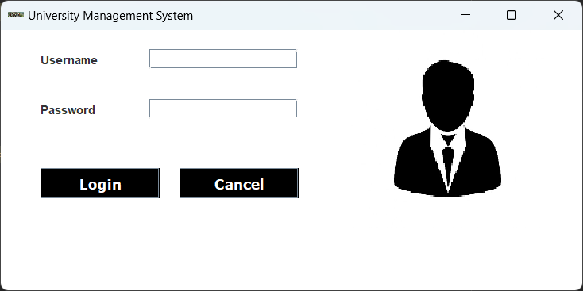
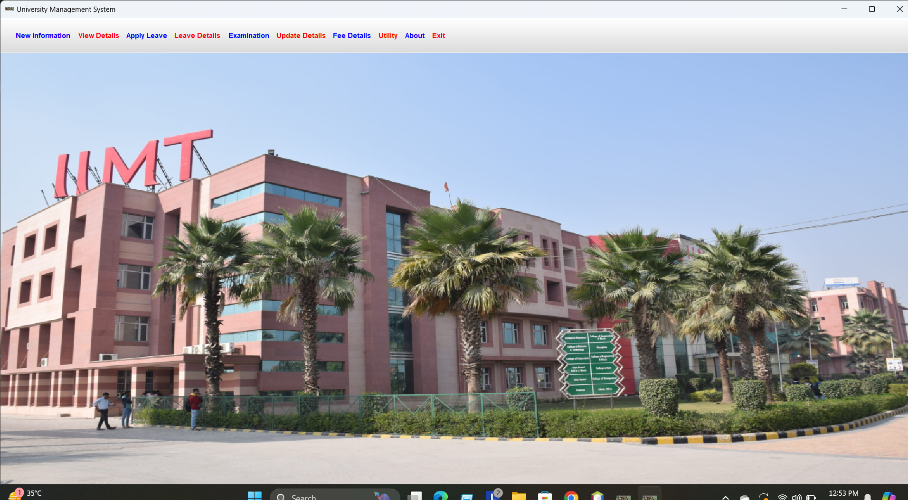

# Java University Management System GUI Project

## Overview
This Java project is a feature-rich University Management System with a Graphical User Interface (GUI). It offers an intuitive interface for performing All HR operations Basically.

## Features
- **User-Friendly:** It Provides an easy to understand user friendly interface . So that a fresher can also easy to use this software.
- **Printing Functionality:** It provides a facility to generate a output of the list of all employees in the form of PDF or through printer.
- **User Authentication and Authorization:** Secure login functionality with role-based access control to ensure data privacy and confidentiality.
- **University Information Management:** Store and manage detailed employee profiles, including personal details, contact information, Department and more.

## Technology Used:-
- **Java Swing GUI**
- **Apache Netbeans IDE**
- **MySql** (for database)
  
## Screenshots

## Getting Started
1. **Prerequisites:** Ensure you have Java installed on your system.
2. **Clone the Repository:** `git clone https://github.com/priyam1608/employee-management-system.git`
3. **Build and Run:** Open the project in your favorite Java IDE and run the `Splash.java` file.

## Usage
- **Adding Employee Details:**

- **View Employee Details:**

- **Update Employee Details:**

- **Remove Employee Details:**

## Contributing
Contributions are welcome! If you have any ideas for improvement or find any bugs, feel free to open an issue or submit a pull request.

## License
This project is licensed under the [MIT License](LICENSE).

## Acknowledgments
- Special thanks to some youtube channels like codewithharry, telusko, codingWallah ,etc for the inspiration and guidance.
